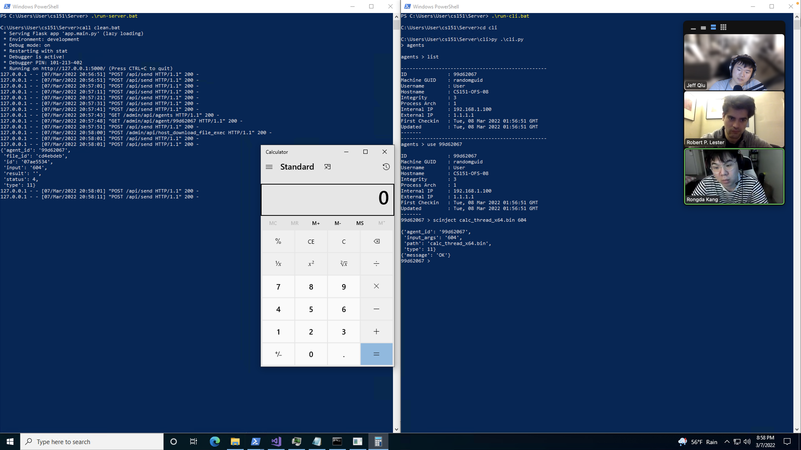
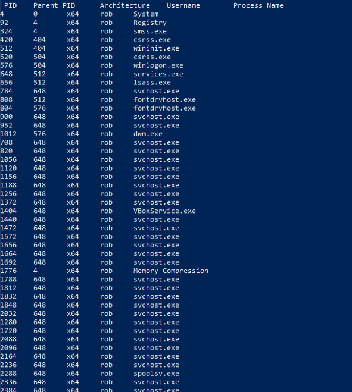
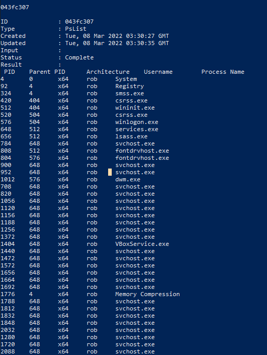

# Homework 5 Tests

0. Purge old database.
1. Fire up server.
2. Run cli.
3. Start a client.
4. Put injection code in the server's directory

## SCInject

CLI commands:
```
C:\Users\User\cs151\Server\cli>py .\cli.py
> agents

agents > list

--------------------------------------------------
ID              : 99d62067
Machine GUID    : randomguid
Username        : User
Hostname        : CS151-OFS-08
Integrity       : 3
Process Arch    : 1
Internal IP     : 192.168.1.100
External IP     : 1.1.1.1
First Checkin   : Tue, 08 Mar 2022 01:56:51 GMT
Updated         : Tue, 08 Mar 2022 01:56:51 GMT
-------
--------------------------------------------------
agents > use 99d62067

ID              : 99d62067
Machine GUID    : randomguid
Username        : User
Hostname        : CS151-OFS-08
Integrity       : 3
Process Arch    : 1
Internal IP     : 192.168.1.100
External IP     : 1.1.1.1
First Checkin   : Tue, 08 Mar 2022 01:56:51 GMT
Updated         : Tue, 08 Mar 2022 01:56:51 GMT
-------
99d62067 > scinject calc_thread_x64.bin 604

{'agent_id': '99d62067',
 'input_args': '604',
 'path': 'calc_thread_x64.bin',
 'type': 11}
{'message': 'OK'}
99d62067 > history

--------------------------------------------------
---
ID              : 07ae5534
Type            : RemoteInject
Input           : 604
Status          : Completed
Created         : Tue, 08 Mar 2022 01:58:00 GMT
Updated         : Tue, 08 Mar 2022 01:58:01 GMT
--------------------------------------------------
99d62067 >
```

Injection result:


Process Table:  

```
C:\Users\rob\Desktop\Group_9\cs151\Server\cli>py .\cli.py
> agents

agents > list

--------------------------------------------------
                No agents
--------------------------------------------------
agents > list

--------------------------------------------------
                No agents
--------------------------------------------------
agents > list

--------------------------------------------------
ID              : 8442f112
Machine GUID    : randomguid
Username        : rob
Hostname        : DESKTOP-0RKB5J9
Integrity       : 3
Process Arch    : 1
Internal IP     : 192.168.1.100
External IP     : 1.1.1.1
First Checkin   : Tue, 08 Mar 2022 02:26:32 GMT
Updated         : Tue, 08 Mar 2022 02:26:32 GMT
-------
--------------------------------------------------
agents > use 8442f112

ID              : 8442f112
Machine GUID    : randomguid
Username        : rob
Hostname        : DESKTOP-0RKB5J9
Integrity       : 3
Process Arch    : 1
Internal IP     : 192.168.1.100
External IP     : 1.1.1.1
First Checkin   : Tue, 08 Mar 2022 02:26:32 GMT
Updated         : Tue, 08 Mar 2022 02:26:32 GMT
-------
8442f112 > ps

{'agent_id': '8442f112', 'input': '', 'status': 1, 'type': 6}
{'message': 'OK'}
8442f112 > history

--------------------------------------------------
---
ID              : 65d9a51c
Type            : PsList
Input           :
Status          : Queued
Created         : Tue, 08 Mar 2022 02:26:46 GMT
Updated         : Tue, 08 Mar 2022 02:26:46 GMT
--------------------------------------------------
8442f112 > history

--------------------------------------------------
---
ID              : 65d9a51c
Type            : PsList
Input           :
Status          : Completed
Created         : Tue, 08 Mar 2022 02:26:46 GMT
Updated         : Tue, 08 Mar 2022 02:26:54 GMT
--------------------------------------------------
8442f112 > task 65d9a51c

65d9a51c

ID              : 65d9a51c
Type            : PsList
Created         : Tue, 08 Mar 2022 02:26:46 GMT
Updated         : Tue, 08 Mar 2022 02:26:54 GMT
Input           :
Status          : Complete
Result          :
 PID    Parent PID      Architecture    Username        Process Name
4       0       x64     rob     System
92      4       x64     rob     Registry
324     4       x64     rob     smss.exe
420     404     x64     rob     csrss.exe
512     404     x64     rob     wininit.exe
520     504     x64     rob     csrss.exe
576     504     x64     rob     winlogon.exe
648     512     x64     rob     services.exe
656     512     x64     rob     lsass.exe
784     648     x64     rob     svchost.exe
808     512     x64     rob     fontdrvhost.exe
804     576     x64     rob     fontdrvhost.exe
900     648     x64     rob     svchost.exe
952     648     x64     rob     svchost.exe
1012    576     x64     rob     dwm.exe
708     648     x64     rob     svchost.exe
820     648     x64     rob     svchost.exe
1056    648     x64     rob     svchost.exe
1120    648     x64     rob     svchost.exe
1156    648     x64     rob     svchost.exe
1188    648     x64     rob     svchost.exe
1256    648     x64     rob     svchost.exe
1372    648     x64     rob     svchost.exe
1404    648     x64     rob     VBoxService.exe
1440    648     x64     rob     svchost.exe
1472    648     x64     rob     svchost.exe
1572    648     x64     rob     svchost.exe
1656    648     x64     rob     svchost.exe
1664    648     x64     rob     svchost.exe
1692    648     x64     rob     svchost.exe
1776    4       x64     rob     Memory Compression
1788    648     x64     rob     svchost.exe
1812    648     x64     rob     svchost.exe
1832    648     x64     rob     svchost.exe
1848    648     x64     rob     svchost.exe
2032    648     x64     rob     svchost.exe
1280    648     x64     rob     svchost.exe
1720    648     x64     rob     svchost.exe
2088    648     x64     rob     svchost.exe
2096    648     x64     rob     svchost.exe
2164    648     x64     rob     svchost.exe
2236    648     x64     rob     svchost.exe
2288    648     x64     rob     spoolsv.exe
2336    648     x64     rob     svchost.exe
2384    648     x64     rob     svchost.exe
2528    648     x64     rob     svchost.exe
2536    648     x64     rob     svchost.exe
2548    648     x64     rob     svchost.exe
2568    648     x64     rob     svchost.exe
2612    648     x64     rob     IpOverUsbSvc.exe
2664    648     x64     rob     svchost.exe
2672    648     x64     rob     nssm.exe
2688    648     x64     rob     svchost.exe
2700    648     x64     rob     wlms.exe
2720    648     x64     rob     svchost.exe
2760    648     x64     rob     svchost.exe
2816    648     x64     rob     svchost.exe
2932    2672    x64     rob     nginx.exe
2448    648     x64     rob     svchost.exe
3164    2932    x64     rob     nginx.exe
3180    3164    x64     rob     conhost.exe
3804    648     x64     rob     svchost.exe
3892    648     x64     rob     svchost.exe
4024    648     x64     rob     svchost.exe
2496    648     x64     rob     SgrmBroker.exe
832     648     x64     rob     uhssvc.exe
3100    648     x64     rob     svchost.exe
964     648     x64     rob     svchost.exe
1292    648     x64     rob     svchost.exe
1844    648     x64     rob     SearchIndexer.exe
4020    1256    x64     rob     sihost.exe
3536    648     x64     rob     svchost.exe
2808    648     x64     rob     svchost.exe
1744    648     x64     rob     svchost.exe
1928    1120    x64     rob     taskhostw.exe
3988    648     x64     rob     svchost.exe
3660    3988    x64     rob     ctfmon.exe
1588    2072    x64     rob     explorer.exe
2472    648     x64     rob     svchost.exe
2084    784     x64     rob     StartMenuExperienceHost.exe
4284    784     x64     rob     RuntimeBroker.exe
4484    784     x64     rob     SearchApp.exe
4608    784     x64     rob     RuntimeBroker.exe
4952    784     x64     rob     YourPhone.exe
3500    784     x64     rob     RuntimeBroker.exe
780     784     x64     rob     TextInputHost.exe
5276    784     x64     rob     dllhost.exe
5524    1588    x64     rob     SecurityHealthSystray.exe
5560    648     x64     rob     SecurityHealthService.exe
5664    1588    x64     rob     VBoxTray.exe
5784    1588    x64     rob     OneDrive.exe
5840    1588    x64     rob     msedge.exe
5856    5840    x64     rob     msedge.exe
6104    5840    x64     rob     msedge.exe
6112    5840    x64     rob     msedge.exe
4576    5840    x64     rob     msedge.exe
6268    648     x64     rob     svchost.exe
6852    3500    x64     rob     powershell.exe
6868    6852    x64     rob     conhost.exe
7064    784     x64     rob     RuntimeBroker.exe
3528    784     x64     rob     SystemSettings.exe
5244    784     x64     rob     ApplicationFrameHost.exe
4784    648     x64     rob     svchost.exe
2420    648     x64     rob     svchost.exe
6056    648     x64     rob     svchost.exe
3520    3500    x64     rob     powershell.exe
1036    3520    x64     rob     conhost.exe
1288    648     x64     rob     svchost.exe
3060    648     x64     rob     svchost.exe
5228    784     x64     rob     Microsoft.Photos.exe
1500    648     x64     rob     svchost.exe
7980    784     x64     rob     RuntimeBroker.exe
7696    648     x64     rob     svchost.exe
7496    648     x64     rob     svchost.exe
548     648     x64     rob     svchost.exe
6848    1588    x64     rob     devenv.exe
5296    6848    x64     rob     PerfWatson2.exe
7824    6848    x64     rob     ServiceHub.Host.Node.x86.exe
4348    7824    x64     rob     conhost.exe
1756    7824    x64     rob     ServiceHub.IdentityHost.exe
4364    7824    x64     rob     ServiceHub.VSDetouredHost.exe
3540    7824    x64     rob     ServiceHub.Host.CLR.x86.exe
6160    7824    x64     rob     ServiceHub.SettingsHost.exe
5800    7824    x64     rob     ServiceHub.DataWarehouseHost.exe
7732    6848    x64     rob     vcpkgsrv.exe
7104    6848    x64     rob     MSBuild.exe
6988    7104    x64     rob     conhost.exe
6888    2376    x64     rob     mspdbsrv.exe
4840    648     x64     rob     StandardCollector.Service.exe
1152    2940    x64     rob     VsDebugConsole.exe
5504    1152    x64     rob     conhost.exe
2144    6852    x64     rob     cmd.exe
4812    2144    x64     rob     flask.exe
5000    4812    x64     rob     python.exe
4336    3520    x64     rob     cmd.exe
6792    4336    x64     rob     py.exe
6688    6792    x64     rob     python.exe
7728    6848    x64     rob     msvsmon.exe
3272    1152    x64     rob     Client.exe
7440    6848    x64     rob     ScriptedSandbox64.exe
1052    0       x64     rob
7964    0       x64     rob
```
High Integrity Output:  

