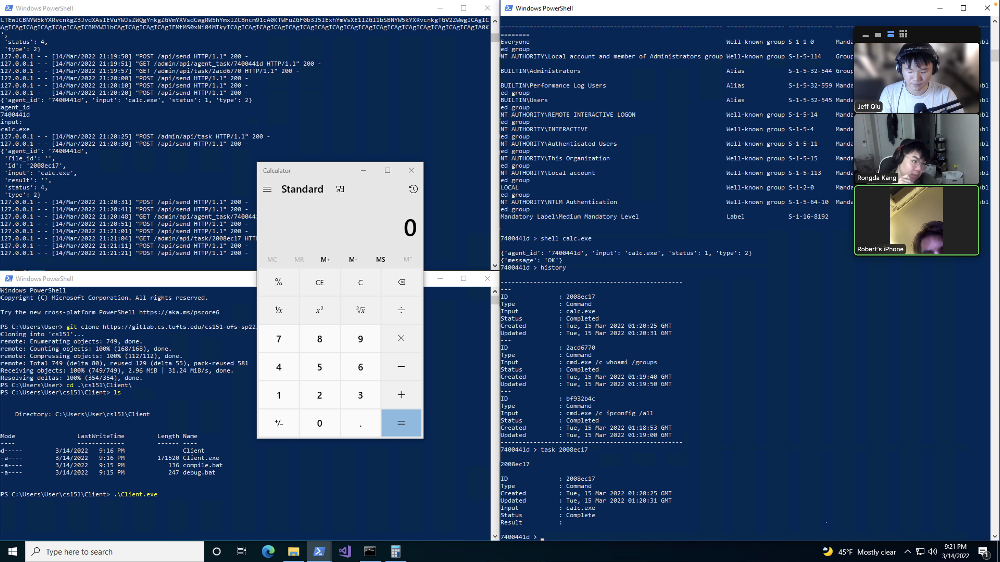

# Homework 6 Tests

## Download

```
C:\Users\User\cs151\Server\cli>py .\cli.py
> agents

agents > list

--------------------------------------------------
ID              : c1a16c91
Machine GUID    : randomguid
Username        : User
Hostname        : CS151-OFS-08
Integrity       : 3
Process Arch    : 2
Internal IP     : 192.168.1.100
External IP     : 1.1.1.1
First Checkin   : Thu, 10 Mar 2022 03:07:46 GMT
Updated         : Thu, 10 Mar 2022 03:07:46 GMT
-------
--------------------------------------------------
agents > use c1a16c91

ID              : c1a16c91
Machine GUID    : randomguid
Username        : User
Hostname        : CS151-OFS-08
Integrity       : 3
Process Arch    : 2
Internal IP     : 192.168.1.100
External IP     : 1.1.1.1
First Checkin   : Thu, 10 Mar 2022 03:07:46 GMT
Updated         : Thu, 10 Mar 2022 03:07:46 GMT
-------
c1a16c91 > upload 5MB.zip 5MB-new.zip

{'agent_id': 'c1a16c91', 'dst_path': '5MB-new.zip', 'path': '5MB.zip'}
{'message': 'OK'}
c1a16c91 > upload 100MB.zip 100MB-new.zip

{'agent_id': 'c1a16c91', 'dst_path': '100MB-new.zip', 'path': '100MB.zip'}
{'message': 'OK'}
c1a16c91 > history

--------------------------------------------------
---
ID              : 0bc7ff71
Type            : Upload
Input           : 100MB-new.zip
Status          : Completed
Created         : Thu, 10 Mar 2022 03:08:23 GMT
Updated         : Thu, 10 Mar 2022 03:13:07 GMT
---
ID              : 8baed156
Type            : Upload
Input           : 5MB-new.zip
Status          : Completed
Created         : Thu, 10 Mar 2022 03:08:06 GMT
Updated         : Thu, 10 Mar 2022 03:08:31 GMT
-------------------------
```

Verifying result

`test.bat`:
```
@echo off
certutil -hashfile 5MB-new.zip MD5 | find /i /v "md5" | find /i /v "certutil"
certutil -hashfile ..\Server\5MB.zip MD5 | find /i /v "md5" | find /i /v "certutil"
certutil -hashfile 100MB-new.zip MD5 | find /i /v "md5" | find /i /v "certutil"
certutil -hashfile ..\Server\100MB.zip MD5 | find /i /v "md5" | find /i /v "certutil"
```
Output:
```
PS C:\Users\User\cs151\Client> .\test.bat
b3215c06647bc550406a9c8ccc378756
b3215c06647bc550406a9c8ccc378756
5b563100babfef2f2ec9ab2d55e97fd1
5b563100babfef2f2ec9ab2d55e97fd1
```

## Shell Command
```
C:\Users\User\cs151\Server\cli>py .\cli.py
> agents

agents > list

--------------------------------------------------
ID              : 7400441d
Machine GUID    : randomguid
Username        : User
Hostname        : CS151-OFS-08
Integrity       : 5
Process Arch    : 1
Internal IP     : 192.168.1.100
External IP     : 1.1.1.1
First Checkin   : Tue, 15 Mar 2022 01:16:50 GMT
Updated         : Tue, 15 Mar 2022 01:16:50 GMT
-------
--------------------------------------------------
agents > use 7400441d

ID              : 7400441d
Machine GUID    : randomguid
Username        : User
Hostname        : CS151-OFS-08
Integrity       : 5
Process Arch    : 1
Internal IP     : 192.168.1.100
External IP     : 1.1.1.1
First Checkin   : Tue, 15 Mar 2022 01:16:50 GMT
Updated         : Tue, 15 Mar 2022 01:16:50 GMT
-------
7400441d > 
```

`ipconfig`

```
7400441d > shell cmd.exe /c ipconfig /all

{'agent_id': '7400441d',
 'input': 'cmd.exe /c ipconfig /all',
 'status': 1,
 'type': 2}
{'message': 'OK'}
7400441d > history

--------------------------------------------------
---
ID              : bf932b4c
Type            : Command
Input           : cmd.exe /c ipconfig /all
Status          : Completed
Created         : Tue, 15 Mar 2022 01:18:53 GMT
Updated         : Tue, 15 Mar 2022 01:19:00 GMT
--------------------------------------------------
7400441d > task bf932b4c

bf932b4c

ID              : bf932b4c
Type            : Command
Created         : Tue, 15 Mar 2022 01:18:53 GMT
Updated         : Tue, 15 Mar 2022 01:19:00 GMT
Input           : cmd.exe /c ipconfig /all
Status          : Complete
Result          :

Windows IP Configuration

   Host Name . . . . . . . . . . . . : CS151-OFS-08
   Primary Dns Suffix  . . . . . . . :
   Node Type . . . . . . . . . . . . : Hybrid
   IP Routing Enabled. . . . . . . . : No
   WINS Proxy Enabled. . . . . . . . : No
   DNS Suffix Search List. . . . . . : eecs.tufts.edu

Ethernet adapter Ethernet0:

   Connection-specific DNS Suffix  . : eecs.tufts.edu
   Description . . . . . . . . . . . : Intel(R) 82574L Gigabit Network Connection
   Physical Address. . . . . . . . . : 00-50-56-83-B7-C3
   DHCP Enabled. . . . . . . . . . . : Yes
   Autoconfiguration Enabled . . . . : Yes
   Link-local IPv6 Address . . . . . : fe80::c1a1:68e6:2ab8:c02b%3(Preferred)
   IPv4 Address. . . . . . . . . . . : 10.5.128.8(Preferred)
   Subnet Mask . . . . . . . . . . . : 255.255.252.0
   Lease Obtained. . . . . . . . . . : Monday, March 14, 2022 9:13:07 PM
   Lease Expires . . . . . . . . . . : Monday, March 21, 2022 9:13:07 PM
   Default Gateway . . . . . . . . . : 10.5.128.1
   DHCP Server . . . . . . . . . . . : 130.64.23.171
   DHCPv6 IAID . . . . . . . . . . . : 100683862
   DHCPv6 Client DUID. . . . . . . . : 00-01-00-01-29-80-B6-8A-00-50-56-83-B7-C3
   DNS Servers . . . . . . . . . . . : 130.64.23.171
                                       130.64.21.254
   Primary WINS Server . . . . . . . : 130.64.23.26
   Secondary WINS Server . . . . . . : 130.64.21.252
                                       130.64.23.192
   NetBIOS over Tcpip. . . . . . . . : Enabled

7400441d > 
```
`whoami`
```
7400441d > shell cmd.exe /c whoami /groups

{'agent_id': '7400441d',
 'input': 'cmd.exe /c whoami /groups',
 'status': 1,
 'type': 2}
{'message': 'OK'}
7400441d > history

--------------------------------------------------
---
ID              : 2acd6770
Type            : Command
Input           : cmd.exe /c whoami /groups
Status          : Completed
Created         : Tue, 15 Mar 2022 01:19:40 GMT
Updated         : Tue, 15 Mar 2022 01:19:50 GMT
---
ID              : bf932b4c
Type            : Command
Input           : cmd.exe /c ipconfig /all
Status          : Completed
Created         : Tue, 15 Mar 2022 01:18:53 GMT
Updated         : Tue, 15 Mar 2022 01:19:00 GMT
--------------------------------------------------
7400441d > task 2acd6770

2acd6770

ID              : 2acd6770
Type            : Command
Created         : Tue, 15 Mar 2022 01:19:40 GMT
Updated         : Tue, 15 Mar 2022 01:19:50 GMT
Input           : cmd.exe /c whoami /groups
Status          : Complete
Result          :

GROUP INFORMATION
-----------------

Group Name                                                    Type             SID          Attributes                                
============================================================= ================ ============ ==================================================
Everyone                                                      Well-known group S-1-1-0      Mandatory group, Enabled by default, Enabled group
NT AUTHORITY\Local account and member of Administrators group Well-known group S-1-5-114    Group used for deny only                  
BUILTIN\Administrators                                        Alias            S-1-5-32-544 Group used for deny only                  
BUILTIN\Performance Log Users                                 Alias            S-1-5-32-559 Mandatory group, Enabled by default, Enabled group
BUILTIN\Users                                                 Alias            S-1-5-32-545 Mandatory group, Enabled by default, Enabled group
NT AUTHORITY\REMOTE INTERACTIVE LOGON                         Well-known group S-1-5-14     Mandatory group, Enabled by default, Enabled group
NT AUTHORITY\INTERACTIVE                                      Well-known group S-1-5-4      Mandatory group, Enabled by default, Enabled group
NT AUTHORITY\Authenticated Users                              Well-known group S-1-5-11     Mandatory group, Enabled by default, Enabled group
NT AUTHORITY\This Organization                                Well-known group S-1-5-15     Mandatory group, Enabled by default, Enabled group
NT AUTHORITY\Local account                                    Well-known group S-1-5-113    Mandatory group, Enabled by default, Enabled group
LOCAL                                                         Well-known group S-1-2-0      Mandatory group, Enabled by default, Enabled group
NT AUTHORITY\NTLM Authentication                              Well-known group S-1-5-64-10  Mandatory group, Enabled by default, Enabled group
Mandatory Label\Medium Mandatory Level                        Label            S-1-16-8192                                            

7400441d > 
```
`calc.exe`

```
shell calc.exe

{'agent_id': '7400441d', 'input': 'calc.exe', 'status': 1, 'type': 2}
{'message': 'OK'}
7400441d > history

--------------------------------------------------
---
ID              : 2008ec17
Type            : Command
Input           : calc.exe
Status          : Completed
Created         : Tue, 15 Mar 2022 01:20:25 GMT
Updated         : Tue, 15 Mar 2022 01:20:31 GMT
---
ID              : 2acd6770
Type            : Command
Input           : cmd.exe /c whoami /groups
Status          : Completed
Created         : Tue, 15 Mar 2022 01:19:40 GMT
Updated         : Tue, 15 Mar 2022 01:19:50 GMT
---
ID              : bf932b4c
Type            : Command
Input           : cmd.exe /c ipconfig /all
Status          : Completed
Created         : Tue, 15 Mar 2022 01:18:53 GMT
Updated         : Tue, 15 Mar 2022 01:19:00 GMT
--------------------------------------------------
7400441d > task 2008ec17

2008ec17

ID              : 2008ec17
Type            : Command
Created         : Tue, 15 Mar 2022 01:20:25 GMT
Updated         : Tue, 15 Mar 2022 01:20:31 GMT
Input           : calc.exe
Status          : Complete
Result          :

7400441d >
```
Screenshot of execution

